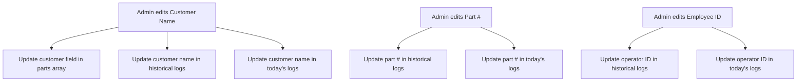

# Gruvfix Production Monitor - Admin Console Implementation

This document provides a comprehensive overview of the newly added admin page functionalities in the **Gruvfix Portal** application. All pages, database logic, CRUD modals, dynamic rendering, and cascading constraints are fully implemented and integrated.

## 1. Unified State & Master Data System
To allow real-time synchronization between the shop floor operator console and the admin management console, the static mapping (`customerPartsMap`) was replaced with a normalized, in-memory state engine in [app.js](file:///C:/Taha%20-%20Personal/Gruvfix%20Project/GruvfixPortal/app.js):

- **`users`**: Master list of credentials, roles, and status.
- **`customers`**: Directory of client accounts (Acme, Coimbatore Premier, Tata Motors, Reliance).
- **`parts`**: Dynamic parts listing mapped to customers with default processes.
- **`historicalEntries`**: Central ledger storing all production log activities, operator IDs, date stamps, quantities, processes, statuses, machines, and attachment details.

---

## 2. Admin Console View Modules
The admin sidebar menu switches views reactively, loading target datasets dynamically:

| Tab View | Functionality & Render Target | HTML Hooks |
| :--- | :--- | :--- |
| **Dashboard** | Displays today's production KPIs (Entries, Quantities, active staff) and status distributions (Completed, Pending, Rework, Hold). Renders custom line and bar graphs. | `#admin-view-dashboard` |
| **All Entries** | Global search and filter ledger showing logs across all employees, shifts, customers, and statuses. Allows status modifications directly in each row. | `#admin-view-entries` |
| **Employees** | User database list. Admins can view roles, edit info, delete users, and quickly toggle active logins. | `#admin-view-employees` |
| **Customers** | Customer directory with search. Updates propagate to other lists. | `#admin-view-customers` |
| **Parts** | Master catalog for components. Connects part codes with default processes and customer owners. | `#admin-view-parts` |
| **Reports** | Custom report builder with Excel (CSV) downloads and formatted printable PDF popups. | `#admin-view-reports` |

---

## 3. Dynamic SVG Telemetry Graphs
No external charts packages (like Chart.js or D3) are used, keeping the app fast and self-contained. Custom SVG paths are drawn on state change:

### A. 7-Day Trend Chart (`#svg-trend-chart`)
- Automatically generates the last 7 calendar days.
- Sums up completed floor quantities per day.
- Draws a green polyline (`#154726`), whitesmoke circles at vertex points, text labels, and a vertical grid system with a fading gradient fill (`url(#trend-gradient)`).

### B. Today by Shift Bar Chart (`#svg-shift-chart`)
- Compares Day Shift A (08:00 - 20:00) vs Night Shift B (20:00 - 08:00) production today.
- Renders rounded rect bars (`<rect rx="4">`) with different green accent colors and hover states.

---

## 4. Cascading Master Data Updates
To maintain ledger integrity, updates to core entities cascade immediately to downstream data:

- **Deletions**: Deleting a customer prompts the admin and cascades to remove all associated parts from the master catalog.
- **Deactivations**: Deactivating a user (setting Active to `Inactive`) blocks their login attempts, displaying a toast notification on the login page.

---

## 5. Report Exports & PDF Print Window
- **CSV & Excel**: Generates a standard comma-separated string mapping all filtered logs, downloading it immediately.
- **PDF Printable Template**: Opens a clean window in the browser, rendering a styled report sheet containing:
  - Centered **Gruvfix Gaskets & Seals LLP** header.
  - Active company logo on the top right.
  - Formatted print metadata block listing applied filters and generation timestamp.
  - Compact border-grid data table with status colors.
  - Triggers the browser's native `window.print()` automatically on page load.

---

## 6. Live Shop Floor Simulator
- When not logged in, simulated entries are created every 10 seconds.
- Simulator chooses a random operator (`EMP001`, `EMP002`, `EMP003`), client, machine, and process, looking up authentic part numbers from the master catalog.
- Simulated entries are added to `historicalEntries` so the admin dashboard updates dynamically in the background!
