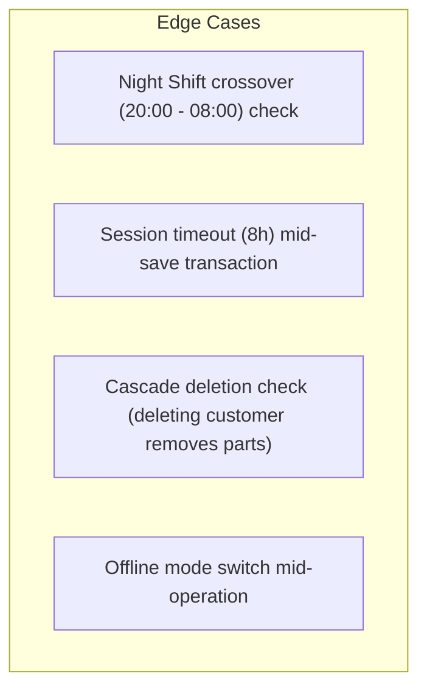

# QA Test Strategy & Plan — Gruvfix Manufacturing Portal v2.2.0

> [!NOTE]
> This document outlines the comprehensive test strategy, methodology, and module-specific plan for the final verification of the Gruvfix Manufacturing Portal. It sets the quality boundaries and execution requirements before any testing starts.

---

## 1. 🎯 Scope & Objectives
The scope of this test plan covers all user interfaces, client-side application logic, database synchronization services, session state managers, and role-based security configurations of the Gruvfix Portal. 

### In-Scope:
* **Authentication**: Employee ID login, Admin email login, route guarding, and token-based Session Management.
* **Operator Console**: Work logging form validations, dynamic hours/shift calculations, searchable comboboxes, and offline fallback loaders.
* **Tool Request Flow**: Requester forms, Admin consoles, quantity deductions, and return/close validation hooks.
* **Admin Master CRUD**: Create, Read, Update, Delete (CRUD) operations on Customers, Parts, Users, and Machines.
* **Reports**: Parameter queries, SVG charting render, and Excel/CSV report exports.
* **Database & RLS**: Supabase table permissions and data synchronization resilience.

### Out-of-Scope:
* Third-party networks or CDN host outages.
* Local OS resource bottlenecks or browser process memory limits.

---

## 2. 🧪 Testing Typologies & Methodology

### 🔑 Authentication & Session Testing
* **Goal**: Verify that role routing is absolute and that user contexts are strictly isolated.
* **Key Scenarios**:
  * Validation of standard email/employee credentials.
  * Inactivity timeout checks: Evicting sessions after exactly 8 hours.
  * Route Guards: Accessing `#/admin/*` from an operator session redirects immediately to `#/login`.

### 🔄 Synchronization & Database Testing
* **Goal**: Validate that client mutations are correctly written to Supabase and offline states handle network drops gracefully.
* **Key Scenarios**:
  * Direct table RLS check: Verifying that `anon` requests cannot execute unauthorized queries.
  * Fallback load verification: Simulating Supabase timeouts and confirming that skeleton loaders transition smoothly to offline cached directories.

### 📈 Performance & Recovery Testing
* **Goal**: Check page responsiveness and database connection pooling under load.
* **Key Scenarios**:
  * Fetch concurrency tests: Running parallel `syncFromSupabase()` operations.
  * Browser recovery: Suddenly disconnecting the internet connection mid-session, logging work, and validating recovery state.

### 📱 UI, Responsive, & Error Testing
* **Goal**: Ensure the user experience (UX) is consistent, legible, and clear.
* **Key Scenarios**:
  * Viewport responsiveness on mobile, tablet, and widescreen.
  * Error visibility: Ensuring validation error notifications print inline inside modal cards rather than on the background page.

---

## 📦 3. Module-by-Module QA Specifications

### Module A: Authentication & Route Guarding
| Detail | Specification |
| :--- | :--- |
| **Objectives** | Ensure login routes block unauthenticated requests and correctly route by role. |
| **Risks** | Session crosstalk; operators bypassing client-side guards to view Admin KPIs. |
| **Entry Criteria** | App loaded; default admin accounts and employee accounts active. |
| **Exit Criteria** | Zero bypass vulnerabilities; 100% of route guard checks pass. |
| **Test Data** | Admin `admin@gruvfix.com`, Operator `EMP001`, deactivated user. |
| **Dependencies** | `SessionManager.js`, `routeGuards.js`. |
| **Expected Coverage**| 100% of defined routes (`/login`, `/admin/*`, `/operator/*`). |

### Module B: Operator Console & Work Logging
| Detail | Specification |
| :--- | :--- |
| **Objectives** | Ensure correct work entries are logged with correct shift ranges. |
| **Risks** | Operator selects incorrect shift hour slot; incorrect machine selection. |
| **Entry Criteria** | Master parts, customers, and machines tables synced from Supabase. |
| **Exit Criteria** | Day/Night shift hourly dropdowns update correctly; form validation blocks invalid inputs. |
| **Test Data** | Shift hour schedules, process selections ('Cutting', 'Machining'). |
| **Dependencies** | `employee.js`, `dropdown.js`, `machines` database. |
| **Expected Coverage**| Shift hours toggling, part row add/remove, process dropdown constraints. |

### Module C: Tool Requests Workflow
| Detail | Specification |
| :--- | :--- |
| **Objectives** | Verify the request-approval-deduction-return cycle. |
| **Risks** | Race conditions during parallel approvals; quantity going below zero. |
| **Entry Criteria** | Master tools list populated with valid stock quantities. |
| **Exit Criteria** | Admin approvals deduct tool quantity; returns request broken tool reason. |
| **Test Data** | Tool requests data, stock counts (`qty`), close conditions. |
| **Dependencies** | `tools.js`, `tool_requests` table. |
| **Expected Coverage**| Request post, Approval deduction, Return state validation, and RLS constraint checking. |

### Module D: Admin Master CRUD
| Detail | Specification |
| :--- | :--- |
| **Objectives** | CRUD operations on master data sync without data loss. |
| **Risks** | Cascade deletions clearing part numbers silently; RLS permission blocks. |
| **Entry Criteria** | Admin login success. |
| **Exit Criteria** | Modifications immediately reflect in the database and local dashboards. |
| **Test Data** | New customers, parts names, user profiles. |
| **Dependencies** | `admin.js`, `state.js`, Supabase client. |
| **Expected Coverage**| Customer CRUD, Part CRUD, Employee CRUD, Machine CRUD. |

### Module E: Reporting & Analytics
| Detail | Specification |
| :--- | :--- |
| **Objectives** | Filter and export logs accurately. |
| **Risks** | Timezone mismatches in logs query; CSV formatting errors. |
| **Entry Criteria** | Log database contains valid production entries. |
| **Exit Criteria** | Queries return correct entries; SVG trends render; CSV download contains query matches. |
| **Test Data** | Date ranges, shift identifiers. |
| **Dependencies** | `admin.js` (trend chart renderers), `xlsx`/CSV exporters. |
| **Expected Coverage**| Filter matches, Chart rendering boundaries, and CSV exports. |

---

## ⚡ 4. High-Priority Edge Cases to Verify

1. **Night Shift Crossover**: Verifying that entries logged at `23:00` on Night Shift appear in reports mapped to the correct calendar day and shift identifier.
2. **Session Expiry mid-save**: Expirying a session using browser local storage deletion right before clicking "Save Customer" and verifying it fails gracefully.
3. **Cascade Deletion Check**: Deleting a customer and verifying that all linked parts are purged from the parts list to prevent orphan records.
4. **Offline Mode Switch**: Disconnecting the internet connection, opening a dropdown, and verifying the skeleton fallback state is displayed.
