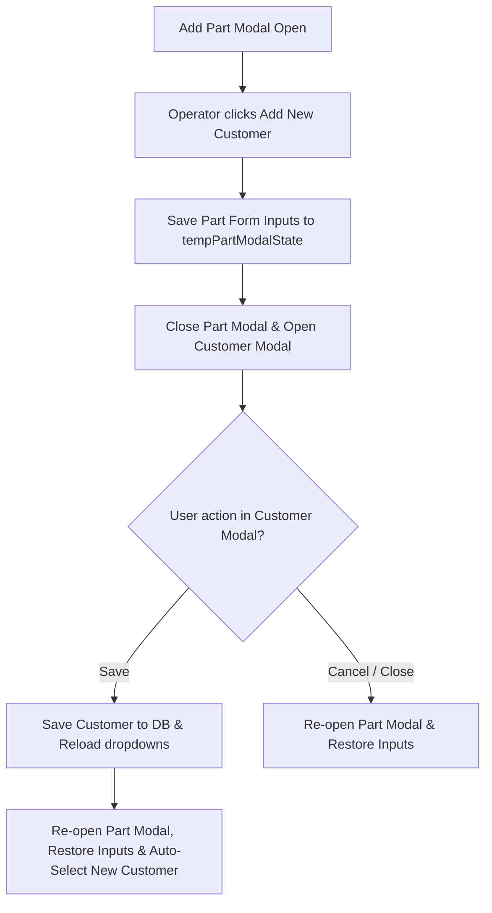

# Technical Specification: Customer Creation from Part Modal

* **Feature Name**: Customer Creation from Part Modal
* **Status**: Draft / Proposed
* **Author**: Antigravity (AI System Architect)
* **Date**: July 8, 2026
* **GitHub Issue Reference**: [#62](https://github.com/TahaKaiyum/gruvfix-portal/issues/62)

---

## 1. Feature Summary
When shop floor operators (Employees) log new production parts, they frequently encounter parts associated with a newly acquired customer. If that customer does not exist in the master table, the operator is unable to proceed since the "Add New Part" modal only permits selecting existing customers.

The **Customer Creation from Part Modal** feature adds a "+ Add New Customer" option directly inside the "Add New Part" modal. Clicking it opens the customer creation form, saves the customer to the master inventory database, and automatically returns the operator back to the part creation form with all previously typed part info preserved.

---

## 2. User Journeys & Personas

### 🧑‍🔧 Shop Floor Operator (Employee)
1. **Adding a Part with New Customer**: Operator opens "+ Add New Part" from the dropdown. They fill out "PART #" and "COMPONENT NAME".
2. **Missing Customer**: They realize the customer is not in the dropdown list. They click the "+ Add New Customer" button next to the customer select field.
3. **Saving Customer**: The part modal closes, and the customer modal opens. They enter the customer details (Name, GST, Code) and click "Save Customer".
4. **Auto-Return**: The customer is successfully synced to the database. The customer modal closes, and the part modal re-opens automatically. The previously typed "PART #" and "COMPONENT NAME" are fully restored, and the newly created customer is pre-selected in the customer dropdown.

---

## 3. Functional Requirements

### `[FR-01]` Modal Integration Button
* The system shall render a "+ Add New Customer" button next to the customer label inside the `#modal-part` form in `index.html`.

### `[FR-02]` Part Input State Preservation
* When opening the customer modal from the part modal, the system shall cache the active part input fields in a temporary state object:
  * `partNo` (Part # value)
  * `comp` (Component Name value)
  * `process` (Default Process value)
  * `index` (Active Part edit index value)
* The part modal shall then close, and the customer modal shall open.

### `[FR-03]` Auto-Return on Save
* Upon successfully saving the customer, the system shall check if a cached part state exists.
* If a cached state exists:
  * Re-open the Add Part modal.
  * Restore the cached `partNo`, `comp`, `process`, and `index` input values.
  * Fetch and populate the updated customer list dropdown, pre-selecting the newly created customer.
  * Clear the cached part state.

### `[FR-04]` Modal Cancellation Flow
* If the operator cancels or closes the customer modal, the system shall check if a cached part state exists.
* If present, re-open the Add Part modal, restore all cached text inputs, and clear the cached state.

---

## 4. Data Models & Schemas
No database migrations are required. The master `customers` table already stores customer records, and the new customer will be appended via standard Supabase upsert calls.

---

## 5. UI & Logic Components

### Core Files
* **Markup**: [index.html](file:///C:/Taha%20-%20Personal/Gruvfix%20Project/GruvfixPortal/index.html#L1581)
* **Controller**: [admin.js](file:///C:/Taha%20-%20Personal/Gruvfix%20Project/GruvfixPortal/src/js/admin.js)

### Logic Flow

