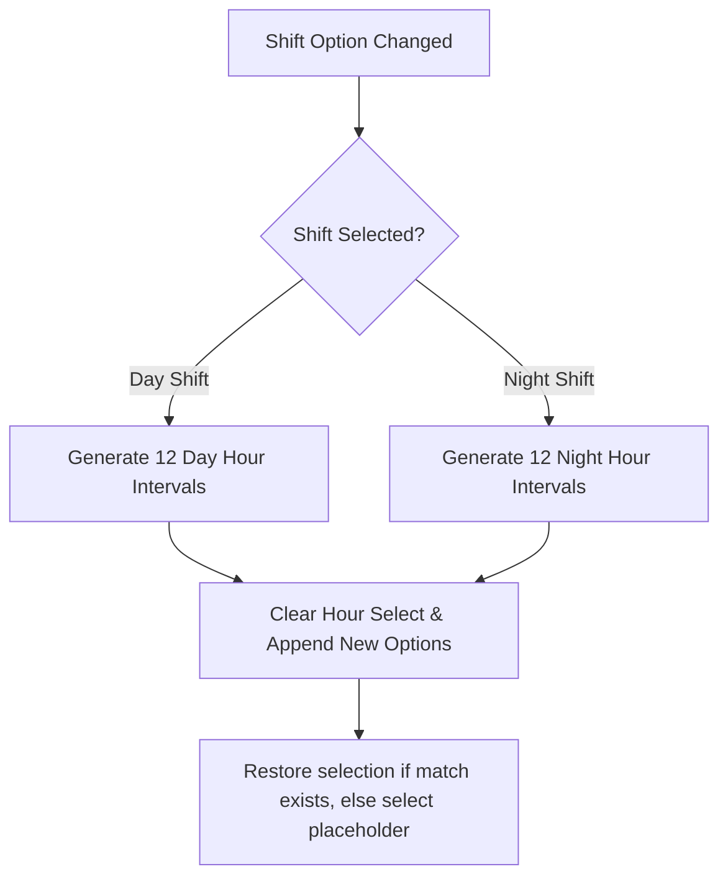

# Technical Specification: Dynamic Shift Hour Slots

* **Feature Name**: Dynamic Shift Hour Slots
* **Status**: Draft / Proposed
* **Author**: Antigravity (AI System Architect)
* **Date**: July 8, 2026
* **GitHub Issue Reference**: [#60](https://github.com/TahaKaiyum/gruvfix-portal/issues/60)

---

## 1. Feature Summary
Operators in the manufacturing portal log their production metrics hourly. Shift patterns are split into:
* **Day Shift (Shift A)**: 08:00 to 20:00
* **Night Shift (Shift B)**: 20:00 to 08:00

Currently, the **Hour Slot** dropdown menu displays static, hardcoded day shift slots (`08:00 - 09:00` to `19:00 - 20:00`). When an operator selects "Night Shift", the hour slot options do not update, which prevents night-shift employees from selecting correct logging hours.

The **Dynamic Shift Hour Slots** feature synchronizes the hourly slot options dynamically when the selected shift is changed, providing the appropriate 12 hourly options for either day or night shift.

---

## 2. User Journeys & Personas

### 🧑‍🔧 Shop Floor Operator (Employee)
1. **Logging Day Production**: The operator navigates to "New Work Entry". The Shift dropdown defaults to "Day Shift". The Hour Slot dropdown is populated with Day Shift slots (`08:00 - 20:00`).
2. **Logging Night Production**: The operator selects "Night Shift (20:00 - 08:00)" in the Shift dropdown. The Hour Slot dropdown immediately updates to display time slots from `20:00 - 21:00` through `07:00 - 08:00`.
3. **Resets**: Clicking "Reset" resets the shift select to "Day Shift" and restores the Day Shift hourly options.

---

## 3. Functional Requirements

### `[FR-01]` Shift Selection listener
* The system shall bind a `change` event listener to the `#entry-shift` dropdown element in the employee console.

### `[FR-02]` Dynamic Hour Option Rebuilding
* When the event is fired, the options of the `#entry-hour` select dropdown shall be cleared.
* If **Day Shift (08:00 - 20:00)** is selected, the dropdown shall be rebuilt with options:
  * `08:00 - 09:00`
  * `09:00 - 10:00`
  * `10:00 - 11:00`
  * `11:00 - 12:00`
  * `12:00 - 13:00`
  * `13:00 - 14:00`
  * `14:00 - 15:00`
  * `15:00 - 16:00`
  * `16:00 - 17:00`
  * `17:00 - 18:00`
  * `18:00 - 19:00`
  * `19:00 - 20:00`
* If **Night Shift (20:00 - 08:00)** is selected, the dropdown shall be rebuilt with options:
  * `20:00 - 21:00`
  * `21:00 - 22:00`
  * `22:00 - 23:00`
  * `23:00 - 00:00`
  * `00:00 - 01:00`
  * `01:00 - 02:00`
  * `02:00 - 03:00`
  * `03:00 - 04:00`
  * `04:00 - 05:00`
  * `05:00 - 06:00`
  * `06:00 - 07:00`
  * `07:00 - 08:00`

### `[FR-03]` Selection Memory & Default Placeholder
* Rebuilding the hourly options shall append a default disabled placeholder option: `<option value="" disabled selected>Select hour</option>`.
* The system shall attempt to retain the operator's previously selected hour slot if that slot is valid in the newly populated list. Otherwise, it shall reset to the default "Select hour" placeholder.

### `[FR-04]` Form Initial State & Reset
* On page load, navigation tab change, and form resets, the Shift dropdown shall default to Day Shift and populate Day Shift hourly intervals.

---

## 4. Data Models & Schemas
No database migrations or column modifications are required. The `logs` table in Supabase stores the hour slot as a plain string (`text`), which already accommodates any text format (e.g. `20:00 - 21:00`).

---

## 5. UI & Logic Components

### Core Files
* **Markup**: [index.html](file:///C:/Taha%20-%20Personal/Gruvfix%20Project/GruvfixPortal/index.html#L415-L438)
* **Controller**: [employee.js](file:///C:/Taha%20-%20Personal/Gruvfix%20Project/GruvfixPortal/src/js/employee.js)

### Logic Flow



### Proposed JavaScript Implementation

```javascript
function populateHourSlots() {
    const shiftSelect = document.getElementById('entry-shift');
    const hourSelect = document.getElementById('entry-hour');
    if (!shiftSelect || !hourSelect) return;

    const selectedShift = shiftSelect.value;
    const prevValue = hourSelect.value;

    let slots = [];
    if (selectedShift.includes('Night Shift')) {
        slots = [
            "20:00 - 21:00",
            "21:00 - 22:00",
            "22:00 - 23:00",
            "23:00 - 00:00",
            "00:00 - 01:00",
            "01:00 - 02:00",
            "02:00 - 03:00",
            "03:00 - 04:00",
            "04:00 - 05:00",
            "05:00 - 06:00",
            "06:00 - 07:00",
            "07:00 - 08:00"
        ];
    } else {
        slots = [
            "08:00 - 09:00",
            "09:00 - 10:00",
            "10:00 - 11:00",
            "11:00 - 12:00",
            "12:00 - 13:00",
            "13:00 - 14:00",
            "14:00 - 15:00",
            "15:00 - 16:00",
            "16:00 - 17:00",
            "17:00 - 18:00",
            "18:00 - 19:00",
            "19:00 - 20:00"
        ];
    }

    hourSelect.innerHTML = '<option value="" disabled selected>Select hour</option>';
    slots.forEach(slot => {
        const opt = document.createElement('option');
        opt.value = slot;
        opt.textContent = slot;
        hourSelect.appendChild(opt);
    });

    if (slots.includes(prevValue)) {
        hourSelect.value = prevValue;
    }
}
```
