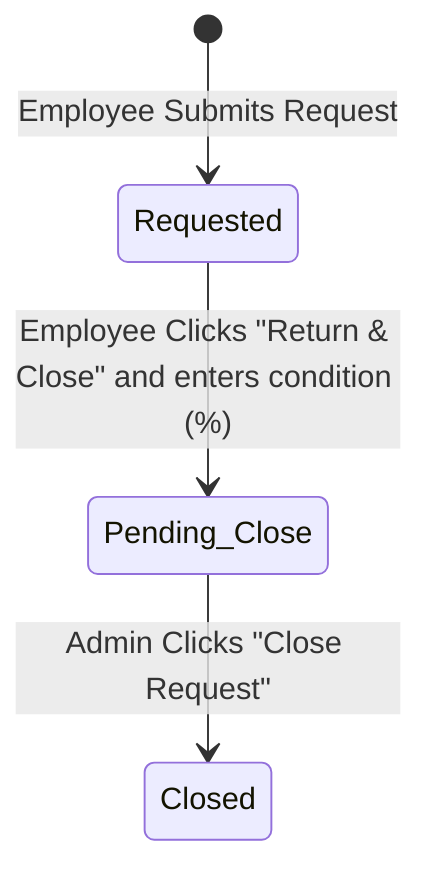

# Technical Specification: Tool Request Control System

* **Feature Name**: Tool Request Control System
* **Status**: Implemented / Completed
* **Author**: Antigravity (AI System Architect)
* **Date**: 2026-06-27

---

## 1. Feature Summary
On a CNC shop floor, tracking the availability, usage, and wear-and-tear of precision tools (end mills, drills, face cutters) is crucial for quality control and inventory management. 

The **Tool Request Control System** provides a workflow for shop floor operators (Employees) to request tools for specific customer production runs, mark them as finished/returned, and report the tool's final condition. Administrators can review returned tools and approve closures, which automatically syncs the wear condition percentage back to the master inventory database.

---

## 2. User Journeys & Personas

### 🧑‍🔧 A. Shop Floor Operator (Employee)
* **Requesting**: An operator logs into their account and navigates to the "Request a Tool" page. They type the name of the tool, select the customer (or type a new customer name if they are working with a new client), specify specifications (diameter, flutes, quantity), and submit.
* **Returning**: When the machining job is finished, the operator goes to their history list, clicks "Return & Close", and inputs the tool's current condition ($0\% - 100\%$) based on wear or damage. The status changes to `Pending Close`.

### 👑 B. Shift Supervisor / Admin (Administrator)
* **Reviewing**: The admin navigates to the "Tool Requests" control board. They see all active employee requests.
* **Approving Returns**: The admin reviews requests marked `Work Over` (Pending Close) and sees the operator's reported return condition (e.g., `85%`). Clicking "Close Request" marks the request as `Closed` and automatically updates the condition index of that tool in the master inventory list.

---

## 3. Functional Requirements

### `[FR-01]` Tool Request Form (Employee Side)
* The system shall display a form for employees containing:
  * Readonly Employee Name (derived from active session).
  * Text input for **Tool Needed** (free-form string).
  * Dropdown selector for **Customer** containing all clients in the master customer array.
  * An option in the Customer dropdown labeled **"Other / Custom Customer"** which, when selected, displays a text input for specifying custom company names.
  * Textarea for **Requirements / Specifications**.
* Submission shall push a new request to the database with state `Requested`.

### `[FR-02]` Request Lifecycle & State Transitions
* The tool request record shall transition through the following states:
  


* **Requested**: Tool is issued and active on the shop floor.
* **Pending Close**: Machining is over; operator has logged return wear condition.
* **Closed**: Admin approved return; condition synchronized in master inventory.

### `[FR-03]` Employee History Table (Employee Side)
* Employees shall only see their own requests filtered by their `employeeId`.
* For `Requested` entries, a **Return & Close** button shall be visible.
* For `Pending Close` entries, a status text saying "Awaiting Admin" shall be visible.
* For `Closed` entries, the status badge changes to `Closed` along with the logged return condition.

### `[FR-04]` Admin Tool Requests Control Board (Admin Side)
* Admins shall see a table listing all tool requests from all operators in the system.
* Active requests (`Requested`) show as "Active (In Use)".
* Requests marked `Pending Close` display a **Close Request** button.
* Approving a return updates the request state to `Closed`.

### `[FR-05]` Master Inventory Synchronization
* Upon admin approval of a tool request closure, the system shall search the master `tools` list for a tool name matching the request's `toolName` (case-insensitive, trimmed match).
* If a match is found, the tool's `condition` value in the master database shall be updated to the `conditionOnClose` percentage reported by the operator.
* If no match is found (e.g., custom tool request), the request closes normally without throwing errors.

---

## 4. Data Models & Schemas

### A. Tool Request Schema (`ToolRequest`)
```typescript
interface ToolRequest {
    id: string;               // Unique ID generated by system (e.g. `req-timestamp`)
    employeeId: string;       // Operator Employee ID (foreign key -> User.empid)
    employeeName: string;     // Operator Display Name
    customer: string;         // Customer Name (string, master customer or custom)
    toolName: string;         // Name of tool requested (string)
    requirements: string;     // Specifications, sizes, flutes, etc.
    status: 'Requested' | 'Pending Close' | 'Closed'; // Lifecycle State
    conditionOnClose: number | null; // Final condition percentage (0-100) logged by employee
}
```

### B. Master Tool Schema (`Tool`)
The request system integrates with the master inventory schema:
```typescript
interface Tool {
    name: string;             // Tool Name (unique identifier key for sync)
    dia: string;              // Shank Diameter (e.g., '10mm')
    fluteLen: string;         // Flute Length (e.g., '25mm')
    toolLen: string;          // Overall Tool Length (e.g., '75mm')
    toolDia: string;          // Tool Cutting Diameter (e.g., '10mm')
    qty: number;              // Stock Quantity
    condition: number;        // Current Condition Percentage (0-100)
}
```

---

## 5. UI Component Contracts

### A. Employee Form component (`#tool-request-form`)
* **Inputs**:
  * `#tool-req-empname` (input text, readonly)
  * `#tool-req-name` (input text, placeholder, required)
  * `#tool-req-customer` (select dropdown, required)
  * `#tool-req-customcust` (input text inside `#tool-req-customcust-group`, required if selector is custom)
  * `#tool-req-specs` (textarea, required)
* **Events**:
  * `onchange` on `#tool-req-customer`: triggers `handleCustomerSelectChange(value)` to toggle the custom input.
  * `onsubmit`: triggers `submitToolRequest(event)`.

### B. Employee Requests Table (`#emp-tool-requests-table`)
* **Selector**: `#emp-tool-requests-tbody`
* **Columns**:
  1. Tool Requested (`toolName`)
  2. Customer (`customer`)
  3. Requirements / Specs (`requirements`)
  4. Status Badge (`status`)
  5. Return Condition (`conditionOnClose` or `—`)
  6. Action Button (`Return & Close` or `—`)

### C. Admin Requests Table (`#admin-tool-requests-table`)
* **Selector**: `#admin-tool-requests-tbody`
* **Columns**:
  1. Employee Details (`employeeName` + `employeeId`)
  2. Customer (`customer`)
  3. Tool Requested (`toolName`)
  4. Requirements / Specs (`requirements`)
  5. Status Badge (`status`)
  6. Return Condition (`conditionOnClose`)
  7. Actions (`Close Request` button if `Pending Close`)

### D. Return Condition Modal (`#modal-return-tool`)
* **Overlay selector**: `#modal-return-tool`
* **Inputs**:
  * `#modal-return-req-id` (hidden input, stores active request ID)
  * `#modal-return-condition` (number input, min `0`, max `100`, defaults to `90`)
* **Events**:
  * `onsubmit`: triggers `submitReturnTool(event)`.
