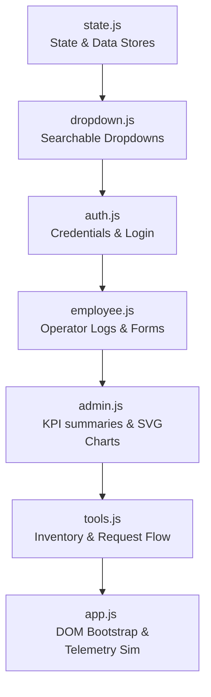

# 📖 Gruvfix Production Portal Operations Guide

Welcome to the **Gruvfix Gaskets & Seals LLP** Production Portal. This guide details every feature of the portal and provides simple, step-by-step instructions on how to operate it.

---

## 🔑 1. Getting Started & Logging In

The portal supports two distinct user roles: **Administrators** and **Shop Floor Employees**.

### 🔐 Access Credentials
Use the pre-configured accounts below to log in or test the portal:

| Role | Username / ID | Password | Access Privileges |
| :--- | :--- | :--- | :--- |
| **Admin** | `admin@gruvfix.com` | `Admin123` | Full control over master registers, tools, requests, and reports. |
| **Employee** | `EMP001` | `Emp@12345` | Logging hourly output, viewing personal log history, requesting tools. |
| **Employee** | `EMP002` | `Emp@12345` | Same as above. |
| **Employee** | `EMP003` | `Emp@12345` | Same as above. |

> [!TIP]
> On the login page, you can click the quick-fill buttons at the bottom of the login card to instantly populate the credentials for testing!

---

## 🛠️ 2. Shop Floor Employee Dashboard

When logged in as an Employee (e.g., `EMP001`), you will see the **Shop Floor** dashboard.

### 📝 A. Logging Production Hours ("New Entry")
Use this tab to log your hourly work output for your shift.

1. **Set General Info**: Select the **Date**, your active **Shift** (Day Shift or Night Shift), and the **Hour Slot** (e.g., `09:00 - 10:00`).
2. **Add Part Rows**: You can log multiple parts in a single hour. Click **`+ Add Row`** at the bottom of the form to append rows.
3. **Select Part & Customer**:
   * Click **`Select Part #`** to open the search dropdown. Type to filter, and select a part. This automatically fills the component name and process.
   * Click **`Select Customer`** to choose the client.
   * *Adding New Records*: If the part or customer is not in the list, click the green **`+ Add New Customer`** or **`+ Add New Part`** button inside the dropdown. Fill in the modal details, and the new item will save and auto-select.
4. **Log Metrics**: Enter the **Quantity** produced, **Machine ID** (e.g., `CNC-01`), and **Status** (`Completed`, `In Progress`, `Pending`).
5. **Attach Files**: Click **`Attach`** to upload drawings, quality inspection images, or spec sheets.
6. **Submit**: Click **`Save Entries`**. Your logged hours will instantly update in the **Today's Logs** table.

### 📅 B. Viewing Personal History ("My History")
1. Click **`My History`** in the employee sidebar.
2. Select a **From Date** and **To Date** to filter your logs.
3. Locked entries (marked with a 🔒 lock badge) have been reviewed by the admin and cannot be deleted. Unlocked entries can be deleted by clicking the red trash can icon.

### 🧰 C. Requesting Tools ("Request a Tool")
When you need shop floor tools for a specific job:
1. Click **`Request a Tool`** in the sidebar.
2. In the form:
   * **Tool Needed**: Type the name of the tool (e.g., *6mm Carbide Endmill*).
   * **Customer**: Select the customer this tool is for. If it's a new customer, select **`Other / Custom Customer`** and type the custom name.
   * **Requirements / Specs**: Specify sizes, flutes, tool length, or other specifications.
3. Click **`Submit Request`**. It will appear in your **My Tool Requests** table as `Requested` (Active).
4. **Returning the Tool**: When you are finished with the tool:
   * Click **`Return & Close`** in your request table.
   * Enter the current condition of the tool in the popup percentage meter ($0\%$ to $100\%$).
   * Click **`Submit Return`**. The status changes to `Pending Close` (Awaiting admin approval).

---

## 👑 3. Admin Control Panel

When logged in as the Administrator, you gain access to the **Admin Console**.

### 📊 A. Production Overview Dashboard
The dashboard displays real-time key metrics:
* **Production KPIs**: Total logs submitted today, total output quantity, active employee count, and customer/part ratios.
* **Daily Status Breakdown**: Counters representing completed, pending, rework, or hold parts.
* **Trend Chart (SVG)**: A visual line chart displaying output trends over the last 7 days.
* **Shift Comparison (SVG)**: A bar chart comparing Shift A (Day) and Shift B (Night) output.
* **Live Shop Floor Monitor**: A simulated real-time terminal log showing live operator check-ins, logged quantities, and machine indicators (Running, Idle, Down).

### 📋 B. Managing All Work Entries
Click **`All Entries`** in the admin sidebar:
* **Global Filters**: Filter the entire company history by Date Range, Employee, Customer, Shift, or Status. Search for parts, components, or operators.
* **Status Updates**: Change the status of any entry dynamically via the inline dropdown (e.g., move an entry from `Pending` to `Completed`).
* **Attachment Previews**: Click any file link to view/simulate file downloads.
* **Delete Logs**: Permanently remove logs by clicking the trash can icon.

### 👥 C. Employees, Customers, & Parts Master Lists
These tabs allow you to manage the database registers.

* **Employees**:
   * View the roster of employees and their active status.
   * Add new employees/admins or toggle existing operators to `Inactive` to prevent login.
* **Customers**:
   * View registered customers, codes, and contact details.
   * Add new customers or edit notes. *Note: Editing a customer name automatically cascades the change to all their parts and historical logs.*
* **Parts**:
   * View part numbers, component descriptions, customer bindings, and standard processes.
   * Add or edit parts. *Note: Editing part details dynamically updates associated histories.*

### 🛠️ D. Tools & Inventory Management
Click **`Tools & Inventory`** in the admin sidebar:
* **Inventory Overview**: View tools with fields including shank dia, flute length, tool length, quantity, and a color-coded **Condition Meter** bar (Green: $\ge 80\%$, Amber: $50\%-79\%$, Red: $< 50\%$).
* **Add/Edit Tools**: Update quantities or adjust conditions.
* **Export list**: Click **`Download Excel`** to download the inventory as a spreadsheet.

### 📩 E. Tool Requests Control
Click **`Tool Requests`** in the admin sidebar:
* **Review Pending Closures**: View active employee requests.
* **Approve Tool Returns**: When an employee submits a return stating `"work is over"`, click **`Close Request`**.
* **Automatic Sync**: Approving a closure automatically updates that tool's condition in the **Tools & Inventory** tab to the percentage reported by the operator.

### 📈 F. Performance Reports & Printing
Click **`Reports`** in the admin sidebar:
* Filter performance metrics by employee, customer, shift, part, and date ranges.
* **Spreadsheet Export**: Click **`Excel`** or **`CSV`** to download raw data.
* **Print PDF**: Click **`PDF`** to open a clean print window with a professional heading, company logo, generated metadata block, and structured logs table.

---

## 💻 4. Code & Architecture Layout

The application has been modularized into 7 clean script files under the `js/` directory:

* **[state.js](file:///C:/Taha%20-%20Personal/Gruvfix%20Project/GruvfixPortal/js/state.js)**: Config, global state, seeding datasets, modals/toasts.
* **[dropdown.js](file:///C:/Taha%20-%20Personal/Gruvfix%20Project/GruvfixPortal/js/dropdown.js)**: Row custom dropdown search & toggles.
* **[auth.js](file:///C:/Taha%20-%20Personal/Gruvfix%20Project/GruvfixPortal/js/auth.js)**: Login, logout, switches, and page transition effects.
* **[employee.js](file:///C:/Taha%20-%20Personal/Gruvfix%20Project/GruvfixPortal/js/employee.js)**: Form validators, row management, file attachments, and personal tables.
* **[admin.js](file:///C:/Taha%20-%20Personal/Gruvfix%20Project/GruvfixPortal/js/admin.js)**: Dashboard updates, SVGs, directories registers, PDF exporter.
* **[tools.js](file:///C:/Taha%20-%20Personal/Gruvfix%20Project/GruvfixPortal/js/tools.js)**: Tools crud, csv export, request workflows.
* **[app.js](file:///C:/Taha%20-%20Personal/Gruvfix%20Project/GruvfixPortal/js/app.js)**: App bootstrap, intervals, live monitor terminal outputs.
